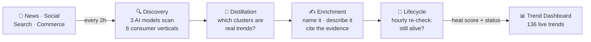

# Trend Tree

Trend Tree watches the public consumer-culture firehose — news, social media, search, and marketplace signals — and decides what's worth calling a trend. It runs end-to-end without human dispatch: naming each trend for two audiences, scoring its heat index, and retiring it when the conversation fades.

---

## How it works

A fresh trend takes **~10–15 minutes** from first signal to named and on the dashboard. The lifecycle agent then re-evaluates every trend hourly — updating its heat index, flagging narrative drift, and retiring trends that have faded.

---

## What you get

Each trend on the dashboard includes:

| Field | Example |
|---|---|
| **B2C name** (editorial / consumer) | *The White Cast Vanishing Act* |
| **B2B name** (sponsorship pitch) | *Invisible Zinc Pivot* |
| **Category** | beauty |
| **Heat index** | 63.8 / 100 |
| **Status** | STABLE |
| **Summary** | Consumers are ditching chemical SPF formulas and reaching for tinted mineral sunscreens that go on invisibly — driven by Korean centella formulas and TikTok's "no white cast" demand. |
| **Sources** | 21 signals across GDELT, Bluesky, Amazon, Google Trends |

A trend promoted today:

> **Topic:** Honey-note gourmand fragrances surging as the new feminine scent direction
> **Status:** NEW · **Initial heat:** 82.4 · **Promotion confidence:** 0.65

---

## Current snapshot

| | |
|---|---|
| Trends actively tracked | **136** |
| Lifecycle evaluations on record | **304** |
| Promotion decisions on record | **357** |
| Enrichment runs on record | **466** |
| Signals available for clustering | **4,227** (last 3 days) |
| Average enrichment cost | **~$0.45** per trend |
| Time from raw signal → named trend | **~10–15 min** end-to-end |

---

## The agents

Five agents run continuously. Each makes one kind of decision:

| Agent | Model | Decides |
|---|---|---|
| **Discovery** | Gemini · Grok · ChatGPT | "Is anything new bubbling up in this vertical?" |
| **Distillation** | Gemini 3.1 Pro | "Among today's signals, which clusters describe a real consumer behavior?" |
| **Promotion** | Gemini 3.1 Pro | "Should this candidate become its own tracked trend, or merge into an existing one?" |
| **Enrichment** | Claude Sonnet 4.6 | "What is this trend, who's it for, what should we call it, what proof do we have?" |
| **Lifecycle** | Gemini 3.1 Pro | "Is this trend still alive, growing, stagnant, or ready to retire?" |

No agent overwrites another's history. Every decision — promote, name, evaluate — is appended to its own ledger with full reasoning preserved.

---

## Data sources

Discovery monitors **six consumer verticals** (wellness, food & beverage, beauty, fashion, home & lifestyle, commerce/retail) across five source families:

- **News** — GDELT (global news event stream)
- **Social** — Bluesky
- **Search** — Google Trends (daily interest curves)
- **Commerce** — Amazon Movers & Shakers
- **Video / Other** — TikTok, Pinterest

---

## What's next

- **Re-enrichment on narrative drift.** When the lifecycle agent detects a trend's story has shifted (a wellness trend pivots from powders to gummies, say), it can request a description rewrite without touching the trend's identity.
- **Operational dashboards.** Cost-per-day, promotion health, and agent-leaderboard panels are planned as Steeple views once that team picks them up.
- **Lifecycle triage of the legacy 324.** The old SQL-clustered trend table is frozen pending a one-shot lifecycle pass to retire stale rows or migrate live ones into the active portfolio.

---

## For technical readers

- **[`docs/schema.md`](docs/schema.md)** — Snowflake table reference, starting with `DT_TREND_DASHBOARD` (the surface Steeple reads). Quick-start queries included.
- **[`docs/architecture.md`](docs/architecture.md)** — Pipedream workflow inventory, inter-workflow HTTP call map, shared library, design patterns, and debugging guide.
