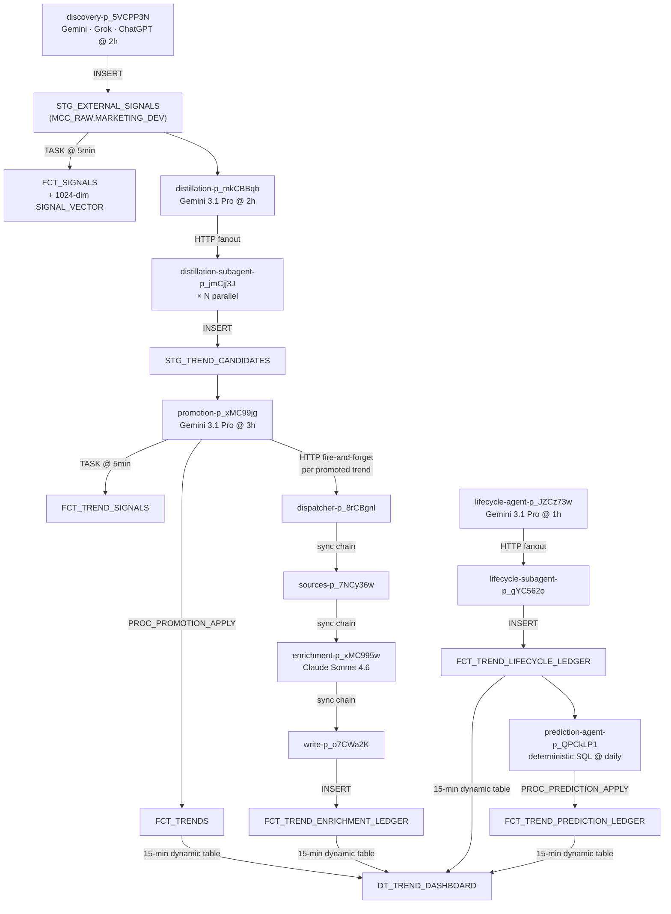

# Trend Tree — Architecture Reference

A deep dive on the Pipedream infrastructure: workflow inventory, inter-workflow HTTP wiring, shared library, design patterns, and debugging.

For the Snowflake data model, see [`schema.md`](schema.md). For the non-technical overview, see [`README.md`](../README.md).

---

## GitHub-sync model

This repo is a **GitHub-synced Pipedream project** (`proj_x9sLmqO`). Every top-level directory named `<name>-p_XXXXXXX/` is one Pipedream workflow. Commits to the `production` branch redeploy all changed workflows automatically.

**Key constraints:**

- **Workflow CREATE is one-way** — you cannot create a new workflow by committing a directory. Pipedream silently ignores new directories. Create workflows in the Pipedream UI first; sync writes the directory back.
- **`authProvisionId` fields are Pipedream-owned** — don't hand-author them. Leave them out on first commit; the user connects the account in the UI and Pipedream writes the ID back on next sync.
- **Snowflake from custom code steps is broken** — use the `snowflake-execute-sql-query@0.2.3` registry action for all SQL. Direct `this.snowflake.executeQuery` calls fail with a generic proxy error.
- **Shared lib imports don't bundle** — copy shared modules into each workflow's local `lib/` subdir. Cross-workflow `import` paths resolve at write time, not at Pipedream's runtime.
- **HTTP trigger `custom_response` is write-once** — set at workflow creation via HTTP Template; can't be toggled after. If `$.respond()` is a no-op and you're getting `<p><b>Success!</b></p>`, the toggle is off for that workflow.

---

## Pipeline overview



---

## Workflow inventory

All workflows share network `net_5Lnie3` (required for Snowflake egress allowlisting).

| Workflow ID | Directory | Trigger | Purpose | Lambda |
|---|---|---|---|---|
| `p_5VCPP3N` | `discovery-p_5VCPP3N` | 3× cron (per-LLM) + HTTP | Multi-model signal discovery across 6 verticals | 4096 MB · 600s |
| `p_mkCBBqb` | `distillation-p_mkCBBqb` | cron 2h + HTTP | Lead orchestrator: cluster-hinted signal window → subagent fanout | 8192 MB · 750s |
| `p_jmCjj3J` | `distillation-subagent-p_jmCjj3J` | HTTP | Per-hypothesis verdict: REAL_TREND / NOISE / DUPLICATE | 4096 MB · 600s |
| `p_o7CWWZl` | `distillation-revisit-p_o7CWWZl` | cron + HTTP | Re-investigates previously deferred candidates | 4096 MB · 750s |
| `p_ezCwwKm` | `distillation-revisit-subagent-p_ezCwwKm` | HTTP | Subagent for revisit pass | 4096 MB · 600s |
| `p_dDCWWPg` | `distillation-watchdog-p_dDCWWPg` | cron ~5min | Fires distillation on demand if pool backlog > threshold or cursor stale | 512 MB · 60s |
| `p_xMC99jg` | `promotion-p_xMC99jg` | cron 3h + HTTP | Candidate → FCT_TRENDS; fires enrichment chain per new trend | 4096 MB · 600s |
| `p_yKCmm9r` | `promotion-agent-p_yKCmm9r` | HTTP | Promotion decision agent (Gemini 3.1 Pro) | 4096 MB · 600s |
| `p_8rCBgnl` | `dispatcher-p_8rCBgnl` | HTTP | Synchronous sources → enrichment → write orchestrator | 2048 MB · 600s |
| `p_7NCy36w` | `sources-p_7NCy36w` | HTTP | Fetches per-source metrics → FCT_TREND_SOURCE_METRICS | 2048 MB · 300s |
| `p_xMC995w` | `enrichment-p_xMC995w` | HTTP | Claude Sonnet 4.6 4-layer naming + enrichment agent | 4096 MB · 600s |
| `p_o7CWa2K` | `write-p_o7CWa2K` | HTTP | Persists enrichment payload → FCT_TREND_ENRICHMENT_LEDGER | 2048 MB · 300s |
| `p_JZCz73w` | `lifecycle-agent-p_JZCz73w` | cron 1h + HTTP | Sweeper: selects due trends → lifecycle subagent fanout | 8192 MB · 750s |
| `p_gYC562o` | `lifecycle-subagent-p_gYC562o` | HTTP | Per-trend status + heat evaluation (Gemini 3.1 Pro) | 4096 MB · 600s |
| `p_KwCoaap` | `lifecycle-attribution-agent-p_KwCoaap` | HTTP | Attribution lifecycle agent | 4096 MB · 600s |
| `p_PACe77B` | `lifecycle-attribution-subagent-p_PACe77B` | HTTP | Attribution lifecycle subagent | 4096 MB · 600s |
| `p_QPCkLP1` | `prediction-agent-p_QPCkLP1` | HTTP (+ daily cron TBD) | Deterministic emergence scorer over all live trends → FCT_TREND_PREDICTION_LEDGER | 4096 MB · 600s |
| `p_13CN9KG` | `gtrends-poller-p_13CN9KG` | cron daily | Google Trends interest curves → FCT_TREND_GTRENDS_DAILY | 2048 MB · 600s |
| `p_vQCkwgV` | `daily-digest-p_vQCkwgV` | cron daily | Assembles + sends trend digest via Braze | 2048 MB · 300s |
| `p_zAC1Nd9` | `error-alerts-p_zAC1Nd9` | HTTP | Slack error notifications when a workflow errors | — |

---

## Per-workflow step summary

### discovery-p_5VCPP3N

Sharded by LLM model (Gemini / Grok / ChatGPT) and by vertical (wellness, food_beverage, beauty_personal_care, fashion_apparel, home_lifestyle, commerce_retail). Three independent cron sources fire this workflow.

Key steps:
1. `route_by_trigger` — reads `.event.model` to determine which LLM steps to run
2. `q_load_prompts` — fetches discovery system prompts from `DIM_LLM_PROMPT`
3. `q_load_active_trends` + `q_load_examples` — loads 200 non-retired trends + 20 high-heat examples for few-shot context
4. `discover_gemini` / `discover_grok` / `discover_chatgpt` — parallel LLM calls per vertical
5. `rerank_claude` — Claude 3.5 Sonnet merges and deduplicates proposals from all three models
6. `write_discovered_signals` — INSERT into `STG_EXTERNAL_SIGNALS`

### distillation-p_mkCBBqb (lead)

Processes a 24h rolling window of unclaimed signals. Calls `PROC_CLUSTER_SIGNAL_SUBSET` (k-means++ over `FCT_SIGNALS.SIGNAL_VECTOR`, K = `ceil(N/20)` clamped to [4, 15]) to produce cluster hints for the LLM.

Key steps:
1. `normalize_event` — coerces trigger payload into a standard run context (`chain_id`, `iteration`, `budget_usd`, `dry_run`)
2. `q_release_stale_claims` — calls `PROC_RELEASE_STALE_SIGNAL_CLAIMS` to unblock signals stuck >1h
3. `q_signals_window` — SELECT 450 unclaimed signals from last 24h
4. `q_cluster_signals` — calls `PROC_CLUSTER_SIGNAL_SUBSET` to annotate signals with `cluster_id` hints
5. `run_lead_agent` — Gemini 3.1 Pro agentic loop with tools: `query_signals_window`, `query_louvain_candidates`, `query_trend_neighbors`, `dispatch_subagent`, `propose_trend_candidate`, plus 4 live search tools
6. `commit_candidates` — INSERT into `STG_TREND_CANDIDATES`
7. `claim_window_signals` — UPDATE `STG_EXTERNAL_SIGNALS.AGENT_SESSION_ID`
8. `update_cursor` — MERGE checkpoint into `STG_DISTILLATION_CURSOR`

### promotion-p_xMC99jg (lead)

Evaluates pending candidates against existing trends via vector similarity. Can loop (retriggers itself) until `max_iterations` or `budget_usd` is exhausted.

Key steps:
1. `q_load_pending_candidates` — SELECT 50 pending candidates
2. `q_compute_vectors_and_neighbors` — embeds each candidate; finds similar existing trends (cosine ≥ 0.50)
3. `q_compute_intra_batch_pairs` — detects internal duplicates within the batch (cosine ≥ 0.70)
4. `run_lead_agent` — HTTP POST to `promotion-agent-p_yKCmm9r`; returns `apply_operations` bundle
5. `apply_promotion` — CALL `PROC_PROMOTION_APPLY(bundle_json)` → writes `FCT_TRENDS` rows + `FCT_PROMOTION_LEDGER`
6. `fire_enrichment_chain` — fire-and-forget fanout to `dispatcher-p_8rCBgnl`, one POST per newly-promoted trend (10 workers, 30s timeout)
7. `eval_and_retrigger` — self-POST with `iteration+1` if budget remains and applied_count > 0

### dispatcher-p_8rCBgnl

Synchronous chain runner. ~200s wall-clock total (comfortably under the 600s Lambda timeout).

Steps:
1. POST to `sources-p_7NCy36w` → waits for source coverage
2. POST to `enrichment-p_xMC995w` → waits for LLM output (enrichment_type = FULL only)
3. POST to `write-p_o7CWa2K` → waits for ledger write confirmation
4. Returns composite result to caller

### enrichment-p_xMC995w

Single Sonnet 4.6 agent loop with 4 refinement layers:
1. **Interleaved thinking** — extended thinking on every tool-call turn
2. **Tool loop** — live cultural grounding via Bluesky / GDELT / Grok / Google Trends tools
3. **In-prompt 5-candidate naming** — anti-cliché blocklist + corporate-media floor (no crude/aggressive names)
4. **Post-emission reviewer** — separate Claude pass that scores names (< 7/10 triggers alternates, ~$0.005)

Input: `POST { "trend_id": "<uuid>" }`. Output: `enrichment_output`, `agent_telemetry`, `llm_token_usage`, `llm_cost_estimate`. Read-only on Snowflake; write-p_o7CWa2K persists downstream.

### lifecycle-agent-p_JZCz73w (sweeper)

Selects trends due for re-evaluation (`NEXT_LIFECYCLE_EVAL_AT <= NOW`, ordered by heat DESC, capped by `sweep_cap`). Fans out to `lifecycle-subagent-p_gYC562o` in parallel (10 workers, 240s timeout per call).

Each subagent evaluates one trend:
- Re-checks Google Trends interest, signal recency, source breadth
- Emits `propose_lifecycle_decision` (new status + `HEAT_MODIFIER_PCT` in [-20, 20])
- Commits via `PROC_LIFECYCLE_APPLY` → inserts into `FCT_TREND_LIFECYCLE_LEDGER`
- Two-cycle retirement confirm: both this eval AND prior eval must propose RETIRE before status changes to RETIRED

### prediction-agent-p_QPCkLP1

Deterministic emergence scorer. Single batch SQL run scores every live (non-RETIRED) trend in one pass. **No LLM in the path** — the 4 inputs the spec calls out are all quantitative and queryable from existing time-series tables, so the scoring is pure CTE chain. See [`prediction-flow.md`](prediction-flow.md) for the full formula + design rationale.

Steps:

1. `normalize_event` — generates `chain_id` per run; accepts `{ chain_id, dry_run }` override on manual POST.
2. `q_score_trends` — one SQL query that JOINs `FCT_TREND_LIFECYCLE_LEDGER` (heat now / 7d / 14d), `FCT_TREND_SIGNALS` (signal flow last-7d vs prior-7d), and a `signal_domains` CTE (source diversity last-7d vs prior-7d), then computes the score + percentile + flag + eligibility in nested CTEs. Output: one row per live trend ready for the ledger.
3. `serialize_decisions` — wraps the row array into the JSON-string payload `PROC_PREDICTION_APPLY` consumes.
4. `commit_to_ledger` — `CALL MCC_RAW.MARKETING_DEV.PROC_PREDICTION_APPLY(PARSE_JSON(:1)::ARRAY, chain_id)`. Atomic batch INSERT.
5. `respond` — returns `{ chain_id, total_rows, scored_count, eligible_count, null_count, committed }`.

The dashboard's `latest_prediction` CTE picks up the most recent row per trend by `EVALUATED_AT` and surfaces 3 additive columns (`PREDICTION_SCORE`, `PREDICTION_FLAG`, `PREDICTION_ELIGIBLE`). **Strict isolation: prediction columns are never read by HEAT_INDEX or LIFECYCLE_STATUS** (a product constraint from Jason Smith).

Trends with fewer than 14 days of post-promotion history emit `PREDICTION_SCORE = NULL` — avoids garbage from missing WoW comparison windows.

---

## Event sources

Sources are deployed components (`dc_xxx` / `sc_xxx`) that trigger workflows independently of the Pipedream UI cron. Source code lives in `sources/<name>/source.mjs`.

| Source directory | Component type | Interval | Emits | Attached to |
|---|---|---|---|---|
| `discovery-cron` | `dc_xxx` × 3 (per-LLM) | Configurable per model | `{ model: "gemini"\|"grok"\|"chatgpt" }` | `discovery-p_5VCPP3N` |
| `lifecycle-cron` | `dc_xxx` | 1h | `{ kind: "lifecycle_tick" }` | `lifecycle-agent-p_JZCz73w` |
| `gtrends-cron` | `dc_xxx` | daily | `{ kind: "gtrends_tick" }` | `gtrends-poller-p_13CN9KG` |
| `agent-http` | `sc_xxx` | HTTP | `{ body, headers, query, method }` | distillation-subagent, lifecycle-subagent |

Deploy pattern for a new cron source:
```sh
pd publish sources/<name>/source.mjs
POST /v1/sources  { component_id, configured_props: { timer: { intervalSeconds } } }
# Add resulting dc_xxx to workflow.yaml triggers:, then git push
```

Update schedule: `PUT /v1/sources/{source_id}` with new `intervalSeconds`.

---

## Ingestion workflows

| Directory | Source | Trigger | Writes to |
|---|---|---|---|
| `ingestion/amazon-p_rvC71gN` | Amazon Movers & Shakers | cron | `STG_EXTERNAL_SIGNALS` |
| `ingestion/bluesky-p_V9CgV17` | Bluesky public feed | cron | `STG_EXTERNAL_SIGNALS` |
| `ingestion/google-trends-p_3nC3xkk` | Google Trends | cron | `STG_EXTERNAL_SIGNALS` |
| `ingestion/tiktok-p_yKCm9Am` | TikTok trending | cron | `STG_EXTERNAL_SIGNALS` (TEST table) |
| `ingestion/pinterest-p_xMC9jR5` | Pinterest trends | cron | `STG_EXTERNAL_SIGNALS` (TEST table) |

**Agent-callable search tools** (HTTP, fired on-demand by agent tool loops):

| Directory | Purpose | Endpoint |
|---|---|---|
| `ingestion/tools/search-bluesky-p_13CNNwP` | Live Bluesky search | `https://eoydyalz1dslfre.m.pipedream.net` |
| `ingestion/tools/search-gdelt-p_WxCppoa` | GDELT news search | `https://eoovhehfk229jrg.m.pipedream.net` |
| `ingestion/tools/search-google-trends-p_YyC88x8` | Google Trends explore | `https://eov9u8rngcgi2z6.m.pipedream.net` |
| `ingestion/tools/grok-live-search-p_vQCkkGK` | Grok live web search | `https://eovzc5ljf76h3h6.m.pipedream.net` |

---

## Shared library (`agents/lib/`)

The shared library lives in `agents/lib/`. Because cross-workflow imports don't bundle in Pipedream's GitHub-sync model, it **must be copied** into each consuming workflow's local `lib/` subdir.

| File | Purpose |
|---|---|
| `gemini_loop.mjs` | Gemini 3.1 Pro agentic loop — thinking tokens, `functionDeclarations`, `functionCall`/`functionResponse` round-trip |
| `anthropic_loop.mjs` | Claude Sonnet 4.6 agentic loop — interleaved thinking, tool dispatch, prompt caching |
| `tool_catalog.mjs` | Central tool registry. Eager tools (always available): `query_signals_window`, `query_trend_neighbors`, `validate_dedupe_pair`, `validate_url_canonical`. Deferred tools (on-demand): `ingest_search_bluesky`, `ingest_search_gdelt`, `ingest_grok_live_search`. Lead-only: `dispatch_subagent`, `propose_trend_candidate`. |
| `prompt_loader.mjs` | Loads prompts from `DIM_LLM_PROMPT` by `PROMPT_KEY` + `IS_ACTIVE = TRUE`. Template expansion via `{{placeholder}}`. |
| `subagent_client.mjs` | `fanoutSubagents({ url, dispatches, concurrency, perCallTimeoutMs })` — parallel HTTP POST fanout with configurable concurrency cap (default 10). Aggregates `{ succeeded, failed, by_verdict }`. |
| `url_canon.mjs` | URL normalization for `SIGNAL_ID` deduplication. Strips UTM params, normalizes AMP variants, resolves redirects. |

---

## Inter-workflow HTTP call map

```
Discovery (p_5VCPP3N)
  ├─ Gemini / Grok / ChatGPT APIs (external, per vertical)
  └─ Anthropic API (Claude 3.5 Sonnet reranker)

Distillation lead (p_mkCBBqb)
  ├─ search-bluesky (p_13CNNwP)    → https://eoydyalz1dslfre.m.pipedream.net
  ├─ search-gdelt (p_WxCppoa)      → https://eoovhehfk229jrg.m.pipedream.net
  ├─ search-google-trends (p_YyC88x8) → https://eov9u8rngcgi2z6.m.pipedream.net
  ├─ grok-live-search (p_vQCkkGK)  → https://eovzc5ljf76h3h6.m.pipedream.net
  └─ distillation-subagent (p_jmCjj3J) → https://eo5h5le4j2qu3tm.m.pipedream.net

Distillation revisit (p_o7CWWZl)
  └─ distillation-revisit-subagent (p_ezCwwKm) → https://40f1843b3006b0f5d1556eff5101ae0d.m.pipedream.net

Distillation watchdog (p_dDCWWPg)
  └─ distillation lead (p_mkCBBqb) → https://eo8lg4tmkchk2qc.m.pipedream.net (conditional)

Promotion lead (p_xMC99jg)
  ├─ promotion-agent (p_yKCmm9r)   → https://eompw435droaqbo.m.pipedream.net
  ├─ dispatcher (p_8rCBgnl)        → https://eoqf5zok2vcvael.m.pipedream.net (one per promoted trend)
  └─ self (retrigger)              → https://eot66usfdph5i7h.m.pipedream.net

Dispatcher (p_8rCBgnl) — synchronous chain:
  ├─ sources (p_7NCy36w)           → https://eoqw249vy2xnwyv.m.pipedream.net
  ├─ enrichment (p_xMC995w)        → https://eoxadsat1xxgqa4.m.pipedream.net
  └─ write (p_o7CWa2K)             → https://eobhhpl77hkx33c.m.pipedream.net

Sources (p_7NCy36w)
  ├─ grok-live-search, search-bluesky, search-gdelt (tool calls, same URLs as distillation)
  └─ Claude 3.5 Sonnet (search term generation, external API)

Enrichment (p_xMC995w)
  └─ bluesky, gdelt, gtrends, grok search tools (same URLs as above)

Lifecycle agent (p_JZCz73w)
  └─ lifecycle-subagent (p_gYC562o) → https://53536769d8379ab44edb7179328e9fd3.m.pipedream.net
```

---

## Key design patterns

### Fire-and-forget fanout

Used by promotion (→ dispatcher per trend) and lifecycle sweeper (→ subagent per trend). The caller fires N HTTP POSTs with a short timeout (30s) and does not await results. Errors surface in the `$errors` event stream of the downstream workflow.

```js
// fanoutSubagents pattern (from subagent_client.mjs)
await fanoutSubagents({ url, dispatches, concurrency: 10, perCallTimeoutMs: 240_000 });
```

### Synchronous chaining

Used by dispatcher to orchestrate sources → enrichment → write in strict sequence. Each step awaits the previous one's HTTP response. Total wall-clock ~200s; the 600s Lambda timeout provides ample buffer. On any HTTP failure, the chain short-circuits and returns `{ error_message }`.

### Self-retrigger loops

Promotion and distillation can run multiple passes within a single chain by POSTing to themselves with `iteration + 1`. Loop terminates on: `max_iterations` hit, `budget_remaining_usd < 0.10`, or `applied_count == 0` (convergence).

### Budget tracking

Every lead workflow tracks `budget_usd` (total) and `budget_remaining_usd` (decremented per iteration). Hard stop when remaining budget exhausted. Prevents runaway cost on large signal backlogs.

### Prompt versioning

All LLM prompts live in `DIM_LLM_PROMPT` (keyed by `PROMPT_KEY`, versioned by `VERSION`, single `IS_ACTIVE = TRUE` row per key). Runtime tuning params (`thinking_level`, `budget_usd`, `max_iterations`) are in the `MODEL_PARAMS` VARIANT column — change prompt behavior without a code deploy.

### Snowflake checkpointing

`STG_DISTILLATION_CURSOR` stores the per-cursor watermark (last signal timestamp, cost metrics, iteration count). Each distillation run reads the cursor at start and writes it at end. If a run fails mid-flight, `PROC_RELEASE_STALE_SIGNAL_CLAIMS` unclaims signals so the next run starts clean.

---

## Operational endpoints

| Action | Endpoint |
|---|---|
| Full chain (sources → enrichment → write) | `POST https://eoqf5zok2vcvael.m.pipedream.net {"trend_id":"<uuid>"}` |
| Enrichment only (sources already fetched) | `POST https://eoxadsat1xxgqa4.m.pipedream.net {"trend_id":"<uuid>"}` |
| Fire distillation manually | `POST https://eo8lg4tmkchk2qc.m.pipedream.net {}` |
| Fire promotion manually | `POST https://eot66usfdph5i7h.m.pipedream.net {}` |
| Fire lifecycle for one trend | `POST https://53536769d8379ab44edb7179328e9fd3.m.pipedream.net {"trend_id":"<uuid>"}` |
| Fire lifecycle sweeper | `POST https://23f3a2c4e5fbd681c1531592137719be.m.pipedream.net {"sweep_cap":25,"write_live":true}` |
| Fire prediction scoring run | `POST https://eoj1i9r5pdvyugj.m.pipedream.net {}` (empty body is fine; pass `{"chain_id":"..."}` to override) |

All endpoints accept JSON, require `Content-Type: application/json`, and support `--max-time 600` (enrichment can take 3–5 min).

---

## Quick debug queries

```sql
-- Most recent lifecycle decisions
SELECT TREND_ID, EVALUATED_AT, NEW_STATUS, NEW_HEAT_SMOOTHED,
       DECISION_PAYLOAD:reasoning::STRING AS reasoning
FROM MCC_PRESENTATION.TREND_AGENT.FCT_TREND_LIFECYCLE_LEDGER
ORDER BY EVALUATED_AT DESC LIMIT 20;

-- Recent promotion decisions with reasoning
SELECT DECIDED_AT, DECISION, DECISION_CATEGORY, TARGET_TREND_ID,
       MAX_NEIGHBOR_SIM, CLUSTER_SIZE, SOURCE_COUNT
FROM MCC_PRESENTATION.TREND_AGENT.FCT_PROMOTION_LEDGER
ORDER BY DECIDED_AT DESC LIMIT 20;

-- Distillation cursor state
SELECT * FROM MCC_RAW.MARKETING_DEV.STG_DISTILLATION_CURSOR;

-- Signals stuck in claim state > 1h
SELECT COUNT(*) AS stuck_signals
FROM MCC_RAW.MARKETING_DEV.STG_EXTERNAL_SIGNALS
WHERE AGENT_SESSION_ID IS NOT NULL
  AND INGESTED_AT < DATEADD(hour, -1, CURRENT_TIMESTAMP());

-- LLM cost by day
SELECT DATE(CREATED_AT_UTC) AS day,
       SUM(TOTAL_TOKENS) AS total_tokens,
       COUNT(*) AS calls
FROM MCC_RAW.MARKETING_DEV.STG_LLM_PROMPT_LOGS
GROUP BY 1 ORDER BY 1 DESC LIMIT 14;
```

---

## Debugging guide

### Workflow errors

Pipedream's REST API exposes errors (but not successful run step outputs):

```sh
# Recent errors for a workflow
curl "https://api.pipedream.com/v1/workflows/{wf_id}/%24errors/event_summaries?org_id=o_qOIvyEa&limit=5&expand=event" \
  -H "Authorization: Bearer $PD_TOKEN"
```

### Snowflake query history

Confirm whether a SQL step actually ran and what it returned:

```sql
SELECT QUERY_TEXT, START_TIME, ROWS_PRODUCED, EXECUTION_STATUS
FROM INFORMATION_SCHEMA.QUERY_HISTORY
WHERE USER_NAME = 'CRMBOT_SERVICE_USER'
ORDER BY START_TIME DESC LIMIT 20;
```

### Custom response not working

If enrichment or a subagent returns HTML (`<p><b>Success!</b></p>`) instead of JSON, the workflow's HTTP trigger has `custom_response` off. Turn it on: trigger card in UI → "Return a custom response from workflow" → deploy.

### Snowflake auth check

`SHOW GRANTS TO ROLE MARKETING_ENGINEER` is authoritative. `USE ROLE` output can be misleading — secondary roles active in a session mask missing primary grants. Dynamic table refresh runs with the primary role only.

### Force-redeploy a workflow

Pure `workflow.yaml` settings changes sometimes don't kick a rebuild. Force one:

```sh
curl -X PUT "https://api.pipedream.com/v1/workflows/{wf_id}" \
  -H "Authorization: Bearer $PD_TOKEN" \
  -d '{"org_id":"o_qOIvyEa","active":true}'
```

---

## Prompt registry

Active prompt keys in `DIM_LLM_PROMPT` (`IS_ACTIVE = TRUE`):

| Key | Model | Notes |
|---|---|---|
| `discovery.gemini.system` | Gemini 3.1 Pro | |
| `discovery.grok.system` | Grok | |
| `discovery.chatgpt.system` | ChatGPT | |
| `distillation.lead.system` v5 | Gemini 3.1 Pro | Cluster-hint aware |
| `distillation.subagent.system` v4 | Gemini 3.1 Pro | |
| `promotion.subagent.system` v2 | Gemini 3.1 Pro | |
| `promotion.subagent.decision_rubric` v2 | Gemini 3.1 Pro | |
| `lifecycle.subagent.system` v2 | Gemini 3.1 Pro | |
| `lifecycle.subagent.decision_rubric` v2 | Gemini 3.1 Pro | |
| `enrichment.system` | Claude Sonnet 4.6 | Only active Anthropic prompt |

To activate a new version without a code deploy: `UPDATE DIM_LLM_PROMPT SET IS_ACTIVE = FALSE WHERE PROMPT_KEY = '...' AND IS_ACTIVE = TRUE`, then `INSERT` the new version with `IS_ACTIVE = TRUE`.

---

## Snowflake connection IDs

| | |
|---|---|
| Pipedream→Snowflake VPC network | `net_5Lnie3` (required in every workflow's `settings:` block) |
| Pipedream connected account | `apn_yghdQYJ` (`CRMBOT_SERVICE_USER`) |
| Snowflake account (direct / snowsql) | `WVB49304-MCCLATCHY_EVAL`, role `MARKETING_ENGINEER`, key-pair auth `~/.snowflake/rsa_key.p8` |
