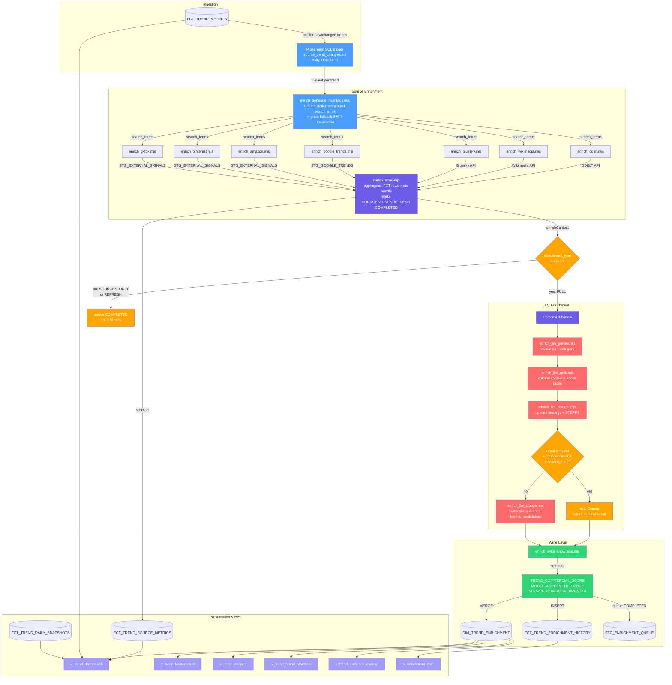

# Enrichment Pipeline Flow

```mermaid
flowchart TD
    subgraph Ingestion
        SRC[Pipedream SQL trigger\nsource_trend_changes.sql\ndaily 11:45 UTC]
        FCT_METRICS[(FCT_TREND_METRICS)]
        FCT_METRICS -->|poll for new/changed trends| SRC
    end

    SRC -->|1 event per trend| HASHTAGS

    subgraph Source Enrichment
        HASHTAGS[enrich_generate_hashtags.mjs\nClaude Haiku: compound search terms\nn-gram fallback if API unavailable]

        HASHTAGS -->|search_terms| GDELT[enrich_gdelt.mjs]
        HASHTAGS -->|search_terms| WIKI[enrich_wikimedia.mjs]
        HASHTAGS -->|search_terms| BSKY[enrich_bluesky.mjs]
        HASHTAGS -->|search_terms| GT[enrich_google_trends.mjs]
        HASHTAGS -->|search_terms| AMZN[enrich_amazon.mjs]
        HASHTAGS -->|search_terms| PINS[enrich_pinterest.mjs]
        HASHTAGS -->|search_terms| TIKT[enrich_tiktok.mjs]

        GDELT -->|GDELT API| ORCH
        WIKI -->|Wikimedia API| ORCH
        BSKY -->|Bluesky API| ORCH
        GT -->|STG_GOOGLE_TRENDS| ORCH
        AMZN -->|STG_EXTERNAL_SIGNALS| ORCH
        PINS -->|STG_EXTERNAL_SIGNALS| ORCH
        TIKT -->|STG_EXTERNAL_SIGNALS| ORCH

        ORCH[enrich_trend.mjs\naggregator: FCT rows + ctx bundle\nmarks SOURCES_ONLY/REFRESH COMPLETED]
    end

    ORCH -->|MERGE| FCT_SOURCE_METRICS[(FCT_TREND_SOURCE_METRICS)]
    ORCH -->|enrichContext| TIER_GUARD{enrichment_type\n= FULL?}

    TIER_GUARD -->|no: SOURCES_ONLY\nor REFRESH| DONE_SOURCES[queue COMPLETED\nno LLM calls]

    TIER_GUARD -->|yes: FULL| LLM_CTX[llmContext bundle]

    subgraph LLM Enrichment
        direction TB
        LLM_CTX --> GEMINI[enrich_llm_gemini.mjs\nvalidation + category]
        GEMINI --> GROK[enrich_llm_grok.mjs\ncultural context + social pulse]
        GROK --> CHATGPT[enrich_llm_chatgpt.mjs\ncontent strategy + STEPPS]
        CHATGPT --> GATE{Gemini invalid\n+ confidence ≥ 0.8\n+ coverage ≤ 2?}
        GATE -->|yes| SKIP[skip Claude\nreturn minimal result]
        GATE -->|no| CLAUDE[enrich_llm_claude.mjs\nsynthesis: audience, brands, confidence]
    end

    SKIP --> WRITE
    CLAUDE --> WRITE

    subgraph Write Layer
        WRITE[enrich_write_snowflake.mjs]
        WRITE -->|compute| SCORES[TREND_COMMERCIAL_SCORE\nMODEL_AGREEMENT_SCORE\nSOURCE_COVERAGE_BREADTH]
        SCORES -->|MERGE| DIM_ENRICH[(DIM_TREND_ENRICHMENT)]
        SCORES -->|INSERT| FCT_HIST[(FCT_TREND_ENRICHMENT_HISTORY)]
        SCORES -->|queue COMPLETED| QUEUE[(STG_ENRICHMENT_QUEUE)]
    end

    subgraph Presentation Views
        DIM_ENRICH --> DASH[v_trend_dashboard]
        FCT_SOURCE_METRICS --> DASH
        FCT_METRICS --> DASH
        SNAPS[(FCT_TREND_DAILY_SNAPSHOTS)] --> DASH

        DIM_ENRICH --> LEADER[v_trend_leaderboard]
        DIM_ENRICH --> LIFECYCLE[v_trend_lifecycle]
        DIM_ENRICH --> BRANDS[v_trend_brand_matches]
        DIM_ENRICH --> AUDIENCE[v_trend_audience_overlap]
        FCT_HIST --> COST[v_enrichment_cost]
    end

    style SRC fill:#4a9eff,color:#fff
    style HASHTAGS fill:#4a9eff,color:#fff
    style ORCH fill:#6c5ce7,color:#fff
    style TIER_GUARD fill:#ffa502,color:#fff
    style DONE_SOURCES fill:#ffa502,color:#fff
    style LLM_CTX fill:#6c5ce7,color:#fff
    style GEMINI fill:#ff6b6b,color:#fff
    style GROK fill:#ff6b6b,color:#fff
    style CHATGPT fill:#ff6b6b,color:#fff
    style CLAUDE fill:#ff6b6b,color:#fff
    style GATE fill:#ffa502,color:#fff
    style SKIP fill:#ffa502,color:#fff
    style WRITE fill:#2ed573,color:#fff
    style SCORES fill:#2ed573,color:#fff
    style DASH fill:#a29bfe,color:#fff
    style LEADER fill:#a29bfe,color:#fff
    style LIFECYCLE fill:#a29bfe,color:#fff
    style BRANDS fill:#a29bfe,color:#fff
    style AUDIENCE fill:#a29bfe,color:#fff
    style COST fill:#a29bfe,color:#fff
```
